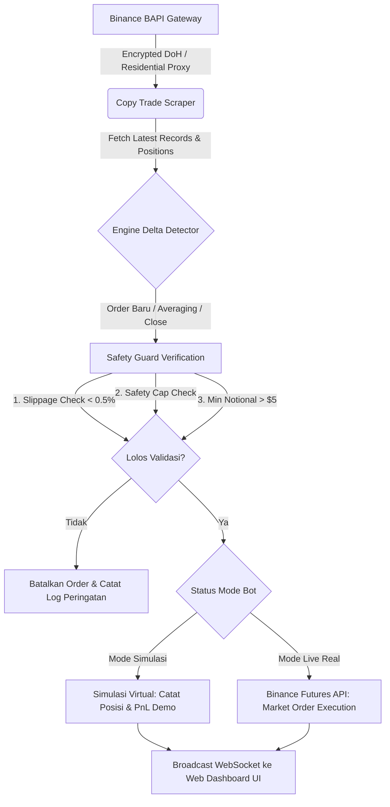

<div align="center">

# ⚡ BINANCE COPY TRADER
### Autonomous Proportional Futures Copy Trading Engine & Real-Time Dashboard

[](https://nodejs.org/)
[](https://www.typescriptlang.org/)
[](https://binance.com/)
[](LICENSE)
[](https://github.com/zamagi17/copy-trading)

<p align="center">
  <b>Aplikasi mandiri (standalone) berkinerja tinggi untuk menyalin transaksi Lead Trader Binance Futures secara otomatis, presisi, proporsional, dan dilengkapi proteksi anti-blokir Cloudflare WAF serta Mode Simulasi (Paper Trading) tanpa risiko uang riil.</b>
</p>

[Fitur Unggulan](#-fitur-unggulan) • [Alur Arsitektur](#-alur-arsitektur-eksekusi) • [Panduan Instalasi](#-panduan-instalasi--penggunaan) • [Deployment VPS](#-deployment-247-di-vps-production) • [Konfigurasi](#-panduan-konfigurasi-configjson)

---

</div>

## 🌟 Fitur Unggulan

### 1. 🎯 Autonomous Delta & Order Stream Tracking
- **Mendukung Private Positions:** Jika lead trader mengunci tab posisi (*positionShow: false*), bot otomatis beralih memantau feed order publik real-time (*Latest Records Stream*) secara instan dengan *cold-start timestamp baseline*.
- **Presisi Transaksi Lengkap:** Mendeteksi posisi baru (*Open Long/Short*), penambahan posisi bertahap (*Averaging/DCA Scaling In*), penutupan sebagian (*Partial Close*), hingga penutupan total (*Full Market Close*).
- **Auto Sync Leverage & Margin Mode:** Otomatis menyelaraskan besaran leverage (10x, 20x, dll.) serta tipe margin (*CROSSED* atau *ISOLATED*) persis mengikuti settingan sang leader.

### 2. 🧪 Mode Simulasi Bebas Risiko (Paper Trading)
- Uji coba performa dan presisi bot secara **100% GRATIS** dengan saldo virtual $100 USDT tanpa perlu memasukkan API Key Binance dan tanpa menyentuh saldo riil.
- Menghitung rasio lot virtual, melacak posisi simulasi, dan menampilkan estimasi profit/loss secara live di dashboard.

### 3. 🛡️ Sistem Proteksi & Manajemen Risiko Berlapis (Safety Guard)
- **Slippage Guard (0.5% default):** Membatalkan eksekusi jika harga pasar telah bergeser melebihi batas toleransi dari harga entry leader (mencegah beli di pucuk).
- **Safety Cap (Maksimal Margin per Koin):** Membatasi nominal modal per aset (misal max $50-$100 USDT) agar modal tidak terkuras habis jika leader melakukan DCA/averaging terus-menerus.
- **Emergency Stop Loss:** Fitur cut-loss independen berbasis persentase drawdown saldo akun untuk proteksi modal darurat.
- **Binance Exchange Filter Normalization:** Otomatis membulatkan ukuran lot ke presisi resmi `stepSize` koin dan memvalidasi batas minimum order Binance (*Min Notional $5 USDT*).

### 4. 🌐 Anti-Blokir Cloudflare & Residential Proxy
- **Bypass DNS-over-HTTPS (DoH):** Bawaan resolver Cloudflare DoH terenkripsi port 443 untuk bypass pemblokiran ISP domestik tanpa biaya saat uji coba lokal.
- **Residential Proxy Integration:** Kompatibel dengan proxy rotasi residential (*DataImpulse, Webshare, IPRoyal*) dengan autentikasi IP/Username-Password untuk operasional 24/7 di VPS tanpa risiko terblokir Cloudflare WAF.
- **Smart Bandwidth Optimization:** Caching profil lead trader 45 detik dan micro-payload request (~1.2 KB per tick), sangat hemat kuota proxy ($5 dapat bertahan 3-4 bulan).

### 5. 🎛️ Cyberpunk Dark Web Dashboard (Port 5000)
- Antarmuka visual modern responsif dengan aksen neon cyberpunk.
- **Real-Time WebSocket Sync:** Pembaruan status bot, saldo, posisi aktif, dan log sistem tanpa perlu refresh halaman.
- **Admin JWT Authentication:** Dilindungi oleh sistem login Master Password dan token JWT terenkripsi untuk keamanan hosting publik di VPS.
- **Live Terminal & Panic Close:** Terminal log real-time dan tombol darurat *Panic Close All* untuk menutup semua posisi seketika.

---

## 🏗️ Alur Arsitektur Eksekusi



---

## 🚀 Panduan Instalasi & Penggunaan

### Prasyarat
- [Node.js](https://nodejs.org/) versi 18.0.0 atau lebih tinggi
- Koneksi internet

### 1. Kloning Repository
```bash
git clone https://github.com/zamagi17/copy-trading.git
cd copy-trading
```

### 2. Instalasi Dependensi
```bash
npm install
```

### 3. Kompilasi TypeScript
```bash
npm run build
```

### 4. Menjalankan Aplikasi
```bash
npm start
```
Buka browser dan akses Web Dashboard di:  
👉 **`http://localhost:5000`**

* **Password Login Default:** `admin123` *(Dapat diganti langsung di menu Pengaturan)*

---

## 🖥️ Panduan Konfigurasi (`config.json`)

Konfigurasi dapat diubah melalui menu **Pengaturan** di dashboard atau langsung pada file `config.json`:

```json
{
  "portfolioId": "5154344801714752768",
  "copyTradeActive": false,
  "paperTrading": true,
  "virtualBalanceUsdt": 100.0,
  "binanceApiKey": "",
  "binanceSecretKey": "",
  "isTestnet": false,
  "mode": "RATIO_EQUITY",
  "ratioMultiplier": 1.0,
  "fixedAmountUsdt": 25.0,
  "maxModalPerCoin": 50.0,
  "maxSlippagePct": 0.5,
  "syncLeverage": true,
  "emergencySlPct": 10.0,
  "pollingIntervalMs": 1500,
  "proxy": {
    "enabled": false,
    "host": "",
    "port": 823,
    "username": "",
    "password": ""
  },
  "adminPassword": "admin123"
}
```

### Penjelasan Parameter Kunci:
| Parameter | Tipe | Deskripsi |
| :--- | :---: | :--- |
| `portfolioId` | String | ID portofolio lead trader dari URL Binance copy trading. |
| `paperTrading` | Boolean | `true` untuk mode simulasi virtual (gratis & aman), `false` untuk live real money. |
| `mode` | String | `RATIO_EQUITY` (proporsional saldo), `FIXED_AMOUNT` (nominal tetap USDT), `FIXED_RATIO` (persentase tetap). |
| `maxModalPerCoin` | Number | Batas nominal maksimal margin per koin (*Safety Cap*). |
| `maxSlippagePct` | Number | Toleransi pergeseran harga maksimal dari entry leader (default `0.5%`). |
| `pollingIntervalMs`| Number | Kecepatan pemantauan transaksi (Rekomendasi: `1500` ms = 1.5 detik). |

---

## ☁️ Deployment 24/7 di VPS (Production)

Agar bot berjalan 24 jam nonstop tanpa perlu komputer lokal menyala:

### 1. Masuk ke VPS & Kloning Repository
```bash
git clone https://github.com/zamagi17/copy-trading.git
cd copy-trading
npm install
npm run build
```

### 2. Gunakan PM2 Process Manager
```bash
# Install PM2 secara global jika belum ada
npm install -g pm2

# Jalankan bot di background
pm2 start dist/server.js --name "binance-copy-trader"

# Simpan konfigurasi auto-restart saat reboot
pm2 save
pm2 startup
```

### 3. Konfigurasi Residential Proxy di VPS
1. Buka dashboard di browser: `http://IP_VPS_ANDA:5000`
2. Buka menu **Pengaturan** $\rightarrow$ centang **Aktifkan Residential Proxy**.
3. Masukkan Host, Port, Username, dan Password dari provider proxy (misal: DataImpulse).
4. Klik **Uji Koneksi Proxy** untuk memastikan status hijau (*Valid*).

---

## 🔒 Praktik Keamanan Rekomendasi
1. **Izin Binance API:** Saat membuat API Key di Binance, hanya aktifkan izin **`Enable Futures`**. **JANGAN PERNAH** mengaktifkan izin `Enable Withdrawals`.
2. **Ganti Master Password:** Segera ganti password default `admin123` di menu Pengaturan sebelum membuka port server ke publik.
3. **Mulai dari Simulasi:** Gunakan *Mode Simulasi (Paper Trading)* terlebih dahulu untuk memvalidasi ritme dan strategi lead trader target Anda.

---

## ⚠️ Disklaimer Risiko
*Trading instrumen kripto derivatif (Futures) mengandung risiko finansial yang tinggi. Masa lalu performa seorang lead trader tidak menjamin keuntungan di masa depan. Aplikasi ini disediakan untuk tujuan otomasi teknis dan edukasi. Gunakan manajemen risiko yang bijak dan modal yang siap Anda tanggung risikonya.*

---

<div align="center">
  <sub>Dibangun dengan dedikasi untuk eksekusi presisi tinggi dan transparansi copy trading.</sub>
</div>
