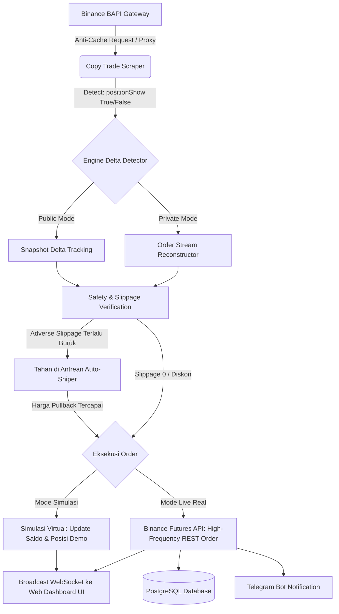

<div align="center">

# ⚡ BINANCE COPY TRADER
### Autonomous Proportional Futures Copy Trading Engine & Real-Time Dashboard

[](https://nodejs.org/)
[](https://www.typescriptlang.org/)
[](https://binance.com/)
[](https://www.postgresql.org/)
[](https://www.docker.com/)
[](LICENSE)

<p align="center">
  <b>Aplikasi mandiri (standalone) berkinerja tinggi untuk menyalin transaksi Lead Trader Binance Futures secara otomatis, presisi, proporsional, dilengkapi fitur Zero-Slippage Auto-Sniper, dukungan Hedge Mode dua arah, proteksi anti-blokir Cloudflare WAF, database PostgreSQL, dan Mode Simulasi (Paper Trading) tanpa risiko uang riil.</b>
</p>

[Fitur Unggulan](#-fitur-unggulan) • [Alur Arsitektur](#-alur-arsitektur-eksekusi) • [Panduan Instalasi](#-panduan-instalasi--penggunaan) • [Konfigurasi](#-panduan-konfigurasi) • [Deployment VPS](#-deployment-247-di-vps-production) • [Keamanan](#-keamanan--privasi)

---

</div>

## 🌟 Fitur Unggulan

### 1. 🎯 Dual-Engine Tracking: Public & Private Positions
- **Mode Publik (Tab Posisi Terbuka):** Membaca snapshot portofolio bursa resmi secara langsung (`lead-data/positions`) dengan *High-Precision Delta State Machine*. Menangkap exact size, leverage riil, dan mark price.
- **Mode Privat (Tab Posisi Digembok):** Jika leader me-private tab posisinya, bot secara otomatis beralih memantau feed order publik real-time (*Latest Records Stream*) melalui endpoint `order-history`. Dilengkapi *cold-start baseline* dan signature deduplikasi unik (`processedOrderKeys`) untuk mencegah eksekusi ganda.
- **Live Dynamic Floating PnL & ROI:** Nilai PnL dan ROI Leader dihitung langsung dari *Real-Time Mark Price* bursa detik demi detik, memastikan tampilan dashboard selalu aktif bergerak sinkron dengan posisi akun Anda.

### 2. ⚡ Zero-Slippage Only & Auto-Sniper Pullback
- **Directional Asymmetric Slippage Guard:** Melindungi order dari *slippage* buruk (mencegah beli di pucuk atau jual di dasar).
- **Auto-Sniper Pullback Pending:** Jika harga pasar saat ini lebih buruk daripada harga entry leader, order tidak langsung dibuang, melainkan **DITAHAN** dalam antrean Auto-Sniper.
- **Auto-Sniper Fill:** Bot memantau chart setiap detik dan akan **OTOMATIS MASUK** begitu harga pasar mengalami *pullback* menyentuh atau melampaui harga entry leader (*Slippage Plus / Diskon*).
- **Averaging Sniper Match:** Fitur sniper juga berlaku penuh untuk layer *Averaging Down / DCA*.

### 3. 🔄 Dukungan Penuh Hedge Mode (Dual-Side Position) & Reverse Trading
- **Hedge Mode Independen:** Memungkinkan akun Anda membuka posisi **LONG** dan **SHORT** secara simultan pada koin yang sama (misal `BTCUSDT LONG` dan `BTCUSDT SHORT`) tanpa saling bertabrakan atau saling menutup.
- **Reverse Trading (Fade Leader):** Opsi strategi inversi untuk membuka posisi berlawanan dengan arah transaksi leader (Leader Long $\rightarrow$ Akun Short, Leader Short $\rightarrow$ Akun Long).

### 4. 🌴 Weekend Break & Daily Sleeping Schedule (WIB / UTC+7)
- **Zona Waktu Indonesia Barat (WIB):** Seluruh logika jadwal, log sistem, dan notifikasi beroperasi dalam standar WIB (UTC+7).
- **Mode Libur Akhir Pekan (Weekend Break):** Mengistirahatkan bot pada akhir pekan untuk menghemat kuota proxy 100% saat pasar sepi.
- **Jadwal Istirahat Harian (Daily Schedule):** Pengaturan jam tidur rutin harian yang dapat dikustomisasi.
- **Auto-Abort Otomatis:** Jika Leader tiba-tiba bertransaksi saat mode libur/tidur aktif, bot secara **OTOMATIS MEMBATALKAN LIBUR** seketika dan langsung menyalin order baru leader tanpa tertinggal.

### 5. 🗄️ Database PostgreSQL + Graceful JSON Fallback
- **Dual Persistence:** Mendukung penyimpanan terpusat menggunakan database PostgreSQL (`copytrading`) untuk riwayat transaksi tertutup (`closed_trades`), snapshot saldo harian (`daily_balance_snapshots`), dan konfigurasi aplikasi.
- **Zero-Downtime Fallback:** Jika database PostgreSQL sedang offline/maintenance, engine otomatis beralih menyimpan ke file JSON lokal (`virtual_state.json`, `trade_history.json`, `config.json`) tanpa menghentikan trading.

### 6. 📱 Notifikasi Telegram Lengkap dengan Transparansi Margin
- **Detail Margin Lengkap:** Setiap alert transaksi Buka Posisi Baru, Averaging Down, maupun Auto-Sniper menyertakan rincian:
  - 💰 *Margin Akun Anda*
  - 👤 *Margin Leader* (sebagai pembanding rasio modal)
  - 💵 *Tambahan Margin per Layer Averaging*
  - 💰 *Akumulasi Total Margin Posisi*
- **Critical Alerting:** Pemberitahuan instan jika terjadi IP Block, kuota proxy habis, kegagalan eksekusi order, atau trailing TP/SL.

### 7. 🧪 Mode Simulasi Bebas Risiko (Paper Trading)
- Uji coba performa dan presisi strategi bot secara **100% GRATIS** dengan saldo virtual USDT tanpa perlu memasukkan API Key Binance dan tanpa menyentuh saldo riil.
- Menghitung rasio lot virtual, melacak posisi simulasi, dan menampilkan estimasi profit/loss secara live di dashboard.

---

## 🏗️ Alur Arsitektur Eksekusi



---

## 🚀 Panduan Instalasi & Penggunaan

### Prasyarat
- [Node.js](https://nodejs.org/) versi 18.0.0 atau lebih tinggi
- PostgreSQL 14+ *(Opsional, bot memiliki fallback otomatis ke JSON)*
- Akun Binance Futures dengan API Key *(hanya izin Futures, tanpa Withdraw)*

### 1. Kloning Repository
```bash
git clone https://github.com/zamagi17/copy-trading.git
cd copy-trading
```

### 2. Instalasi Dependensi
```bash
npm install
```

### 3. Konfigurasi Lingkungan (`.env`)
Salin file `.env.example` menjadi `.env`:
```bash
cp .env.example .env
```
Sesuaikan konfigurasi port dan database pada file `.env`:
```env
PORT=5000
TZ=Asia/Jakarta

DB_HOST=127.0.0.1
DB_PORT=5432
DB_USER=postgres
DB_PASSWORD=your_password_here
DB_NAME=copytrading
```

### 4. Kompilasi TypeScript & Menjalankan Aplikasi
```bash
# Build TypeScript ke JavaScript
npm run build

# Menjalankan server
npm start
```

Buka browser dan akses Web Dashboard di:  
👉 **`http://localhost:5000`**

* **Password Login Default:** `admin123` *(Dapat diubah di menu Pengaturan)*

---

## 🖥️ Panduan Konfigurasi (`config.json`)

Konfigurasi bot dapat diatur langsung melalui Web Dashboard atau pada file `config.json`:

```json
{
  "portfolioId": "5154344801714752768",
  "copyTradeActive": true,
  "paperTrading": true,
  "virtualBalanceUsdt": 1000,
  "binanceApiKey": "",
  "binanceSecretKey": "",
  "isTestnet": false,
  "mode": "FIXED_AMOUNT",
  "ratioMultiplier": 1,
  "fixedAmountUsdt": 50,
  "maxModalPerCoin": 0,
  "maxSlippagePct": 0.5,
  "reverseTrading": false,
  "reorderWindowMinutes": 120,
  "zeroSlippageOnly": true,
  "sniperPullbackEnabled": true,
  "syncLeverage": true,
  "emergencySlPct": 80,
  "pollingIntervalMs": 1500,
  "weekendBreak": {
    "enabled": true,
    "timezone": "WIB",
    "standbyIntervalSec": 60,
    "autoAbortOnLeaderTrade": true
  },
  "proxy": {
    "enabled": false,
    "host": "",
    "port": 823,
    "username": "",
    "password": ""
  },
  "telegram": {
    "enabled": false,
    "botToken": "",
    "chatId": ""
  },
  "adminPassword": "admin123",
  "jwtSecret": "copytrade_secret_key_change_me_987"
}
```

### Penjelasan Parameter Kunci:

| Parameter | Tipe | Deskripsi |
| :--- | :---: | :--- |
| `portfolioId` | String | ID portofolio Lead Trader dari URL Binance Copy Trading. |
| `paperTrading` | Boolean | `true` untuk mode simulasi bebas risiko, `false` untuk live real money. |
| `mode` | String | `FIXED_AMOUNT` (nominal tetap USDT), `RATIO_EQUITY` (proporsional modal), `FIXED_RATIO` (persentase modal). |
| `zeroSlippageOnly` | Boolean | Jika `true`, bot hanya masuk saat harga sama persis atau lebih untung (*Slippage Plus*). |
| `sniperPullbackEnabled` | Boolean | Jika `true`, order dengan slippage buruk ditahan hingga harga mengalami *pullback*. |
| `reverseTrading` | Boolean | Mode *Fade Leader* (membalik arah sinyal transaksi leader). |
| `syncLeverage` | Boolean | Menyelaraskan besaran leverage dan margin type akun mengikuti leader. |
| `maxModalPerCoin` | Number | Batas nominal margin maksimum per koin (`0` untuk tanpa batas). |
| `emergencySlPct` | Number | Cut loss darurat berbasis persentase drawdown modal. |

---

## ☁️ Deployment 24/7 di VPS (Production)

### Metode 1: Menggunakan Docker Compose (Direkomendasikan)
File `docker-compose.yml` telah disediakan:
```bash
# Jalankan container di background
docker compose up -d --build

# Melihat log bot
docker compose logs -f
```

### Metode 2: Menggunakan PM2
```bash
# Install PM2 secara global
npm install -g pm2

# Build & jalankan bot
npm run build
pm2 start dist/server.js --name "binance-copy-trader"

# Simpan service agar otomatis menyala saat reboot
pm2 save
pm2 startup
```

---

## 🔒 Keamanan & Privasi

1. **Izin Binance API:** Saat membuat API Key di Binance, **HANYA** centang opsi **`Enable Futures`**. **JANGAN PERNAH** mengaktifkan opsi `Enable Withdrawals` demi keamanan aset Anda.
2. **Kerahasiaan Kredensial:** Seluruh API Key, Secret Key, token Telegram, dan kredensial database disimpan secara lokal pada file `.env` dan `config.json` di server Anda sendiri, dan secara ketat diproteksi oleh `.gitignore` agar tidak pernah terunggah ke repositori Git publik.
3. **Pengaturan Mode Posisi:** Untuk memaksimalkan performa copy trading pada leader yang melakukan *hedging*, pastikan akun Binance Futures Anda disetel ke **Mode Lindung Nilai (Hedge Mode)** di aplikasi Binance.

---

## ⚠️ Disklaimer Risiko
*Trading instrumen kripto derivatif (Futures) memiliki tingkat risiko finansial yang tinggi. Kinerja masa lalu seorang Lead Trader tidak menjamin keuntungan di masa depan. Aplikasi ini disediakan untuk tujuan otomasi teknis dan edukasi. Gunakan selalu manajemen risiko yang bijak dan gunakan modal yang siap Anda tanggung risikonya.*

---

<div align="center">
  <sub>Dibangun dengan standar presisi tinggi, zero-slippage execution, dan keamanan tingkat produksi.</sub>
</div>
